# rig-bench

A clean-slate multi-agent harness for Claude Code. Spec-driven development with a plan→execute pipeline, concurrent worktree-isolated execution, a structured lifecycle for every deliverable, and a persistent memory system that gives every agent codebase context without re-reading files.

---

## What It Is

**rig-bench** gives you a disciplined, end-to-end loop for AI-driven software engineering:

1. **Plan** — design a spec interactively before any code is written
2. **Execute** — implement specs concurrently, each agent in its own git worktree
3. **Verify** — confirm implementation matches requirements before marking as finished
4. **Remember** — structural index, git history, and AI-generated docs persist across runs so agents start informed

The `operator` agent is the core execution primitive. It runs inside an isolated git worktree per spec, creates a feature branch, implements, commits, and advances the spec through the lifecycle — all without touching any other spec's work.

---

## Repository Layout

```
rig-bench/
├── .claude/
│   ├── agents/
│   │   ├── operator.md       # Plan + implement (orchestrator or per-spec worker)
│   │   ├── inspector.md      # Verification + drift detection (worktree-isolated, read-only)
│   │   └── shipper.md        # Push, PR, squash-merge (worktree-isolated)
│   ├── commands/
│   │   ├── execute.md        # /execute [project] — execute one or more ready specs
│   │   └── verify.md         # /verify  [project] — verify waiting specs against their criteria
│   ├── skills/
│   │   └── spec-plan/        # Interactive spec authoring — triggers from conversation, not just a slash command
│   └── settings.json         # Permissions
├── workflows/
│   ├── operator.js           # Orchestrator: Discover/PreFlight/Execute; delegates Verify + Ship
│   ├── inspector.js          # Verify-only sub-workflow (called by operator.js)
│   ├── ship.js               # Ship-only sub-workflow (called by operator.js)
│   └── bootstrap-memory.js   # One-shot AI memory generation (Architect + Reviewer agents)
├── scripts/
│   ├── bootstrap-git-history.sh   # Index last 50 commits → memory/archive/git/index.json
│   ├── build-structure-index.sh   # Scan repo exports/imports → memory/structure.json
│   ├── search-structure.sh        # Query structural index (used by operator)
│   ├── search-git-history.sh      # Query git history index with LEGACY tagging
│   ├── read-file-summary.sh       # Read cached file summary (hash-invalidated)
│   ├── write-file-summary.sh      # Write file summary to cache
│   ├── read-worktree-diff.sh      # Print diff vs main, truncated to 10k lines
│   └── archive-spec.sh            # Archive a finished spec into memory/archive/
├── memory/                   # Persistent memory vault
│   ├── ARCHITECTURE.md       # AI-generated system architecture (semantic memory)
│   ├── RULES.md              # AI-generated coding standards (semantic memory)
│   ├── PENDING_UPDATES.md    # Drift alerts awaiting resolution
│   ├── structure.json        # Structural index of all source files
│   └── archive/
│       ├── git/index.json    # Git commit history (last 50, with LEGACY tagging)
│       ├── index.json        # Index of archived finished specs
│       └── summaries/        # Hash-invalidated file summary cache
├── specs/                    # Spec lifecycle folders, scoped per project
│   ├── spec-template.md      # Canonical spec shape — single source of truth
│   └── template/             # This harness's own specs (specs/<name>/ for projects/<name>/)
│       ├── draft/                # Being written; may have [NEEDS CLARIFICATION] markers
│       ├── ready/                # All ambiguity resolved; ready to execute
│       ├── in_progress/          # Actively being implemented
│       ├── waiting_verification/ # Implementation complete; awaiting human confirmation
│       ├── finished/             # Shipped — merged PR is the permanent record
│       ├── blocked/              # Waiting on a dependency or decision
│       └── abandoned/            # Won't do; kept for reference
├── hooks/                    # Reserved for lifecycle hooks
├── lib/                      # Reserved for shared libraries
├── config/schemas/           # Reserved for JSON schemas
├── tests/                    # Reserved for test harness
└── projects/                 # Standalone project repos (each is its own git repo)
```

---

## Agents

Three agents, each with a focused role:

| Agent | File | Role | Model | Isolation |
|---|---|---|---|---|
| `operator` | `.claude/agents/operator.md` | Plans and implements specs — orchestrator when invoked top-level, implementer when spawned per-spec | Sonnet | worktree |
| `inspector` | `.claude/agents/inspector.md` | Verifies implementation against acceptance criteria (read-only) | Sonnet | worktree |
| `shipper` | `.claude/agents/shipper.md` | Pushes the verified branch, opens a PR, and squash-merges it | Haiku | worktree |

### operator

Two modes, one agent:

**Orchestrator mode** (invoked with a task description):
1. **Plan phase** — same workflow as the `spec-plan` skill (`.claude/skills/spec-plan/SKILL.md`): resolves which project under `specs/<project_name>/` the task belongs to, reads `specs/README.md` and `specs/spec-template.md`, finds the next spec ID for that project, captures intent with the user via `AskUserQuestion`, drafts specs, gets user approval, writes them to `specs/<project_name>/ready/`
2. **Execute phase** — same workflow as `.claude/commands/execute.md`: validates dependencies, then invokes `workflows/operator.js` which fans out concurrent per-spec execution — each spec runs in its own worktree via a fresh operator spawn

**Implement mode** (spawned by the workflow with a specific spec):
1. Creates a feature branch (`{id}-{slug}`)
2. Moves spec `specs/<project_name>/ready/ → specs/<project_name>/in_progress/` and commits
3. Reads the spec, implements all acceptance criteria
4. Commits the implementation (staged explicitly, never `git add -A`)
5. Moves spec `specs/<project_name>/in_progress/ → specs/<project_name>/waiting_verification/`, updates status frontmatter
6. Returns: `spec_id`, `status`, `branch`, `summary`, `errors`

### inspector

1. Checks out the feature branch in its worktree
2. Reads the spec from `specs/<project_name>/waiting_verification/{filename}`
3. Checks each EARS-style acceptance criterion — finds the specific code (file:line) that satisfies it
4. Runs the `Verification` step from the spec
5. Returns: `spec_id`, `verdict` (PASS/FAIL), `criteria_results[]`, `failures[]`

### shipper

Only runs after the inspector has already returned `PASS` — never implements or re-verifies anything itself. Ships one of two ways, decided by reading "Files / Interfaces Touched" in the spec:

**Harness spec** (changes live in the rig-bench worktree, spec lives in `specs/template/`):
1. Checks out the feature branch, commits any pending changes
2. Pushes the branch: `git push origin {branch}`
3. Opens a PR: `gh pr create` with spec criteria as the body
4. Squash-merges it: `gh pr merge --squash --delete-branch`
5. Returns to `main`, pulls, and calls `scripts/archive-spec.sh template {id}` once the spec lands in `specs/template/finished/`

**Project spec** (files under `projects/{name}/` — its own standalone git repo):
1. `cd projects/{name}`; `git init` on first ship if no repo exists yet
2. Commits any pending changes, pushes (creating the GitHub remote via `gh repo create` on first ship)
3. Opens and squash-merges a PR against the project's own `main`

Returns: `spec_id`, `status` (shipped/failed), `pr_url`, `branch` or `repo_url`, `summary`.

---

## The Execution Pipeline (`workflows/operator.js` + `inspector.js` + `ship.js`)

Three agents, three jobs, no overlap — and now three separate workflow files to match: **operator** only implements, **inspector** only verifies, **shipper** only ships.

- `workflows/operator.js` is the orchestrator. It discovers specs, refreshes the structural index, and implements each spec itself (`agentType: operator`) — but it never verifies or ships a spec. For those it calls a sub-workflow via the `workflow()` primitive and waits for a result.
- `workflows/inspector.js` is called by `workflows/operator.js` as `workflow({ scriptPath: 'workflows/inspector.js' }, { id, title, filename, branch })`. It runs the inspector agent, handles drift detection, and returns one verdict. It never re-executes or re-verifies.
- `workflows/ship.js` is called the same way, only after `workflows/inspector.js` returns `PASS`. It runs the shipper agent and returns. It never implements or verifies.

The `Workflow` tool only allows **one level** of sub-workflow nesting — a script invoked via `workflow()` can't itself call `workflow()`. That's why the retry-on-FAIL loop (re-execute once, then re-verify) lives in `workflows/operator.js` rather than inside `workflows/inspector.js`: the orchestrator calls `workflow()` for inspector, gets a FAIL, re-executes inline (`agent()` with `agentType: operator`, not a nested `workflow()` call), then calls `workflow()` for inspector a second time. Each of those calls is depth 1 from the orchestrator's point of view.

Specs with no dependency relationship run **concurrently** in the same wave; later waves start only after the previous wave fully completes. Set `depends_on` in spec frontmatter to control ordering.

### Overview — six stages, one spec's journey


### ① Discover — `workflows/operator.js`

Reads `specs/<project_name>/ready/`, reads frontmatter (`id`, `depends_on`, `complexity`), and collects already-`finished` IDs to build the dependency-wave graph. No worktree, no implementation — just inventory.

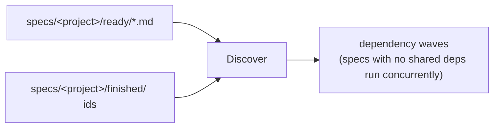

### ② PreFlight — `workflows/operator.js`

Runs once per workflow invocation, before any wave starts, so every agent in every wave sees the same up-to-date map.

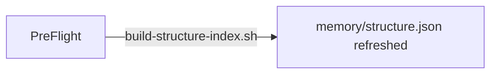

### ③ Execute — `workflows/operator.js`, `agentType: operator`

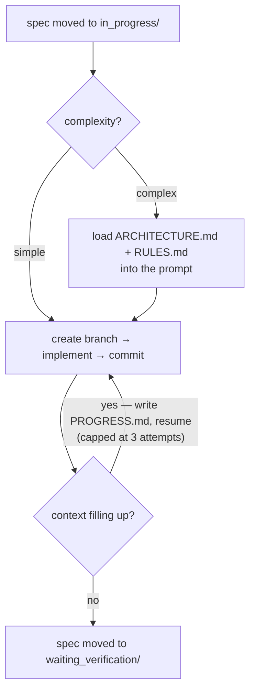

### ④ Verify — `workflows/inspector.js`, `agentType: inspector` (read-only — never edits code)

Called by `workflows/operator.js` via `workflow()`. Returns one verdict and is done — the retry loop below is the *caller's* job, not this file's.

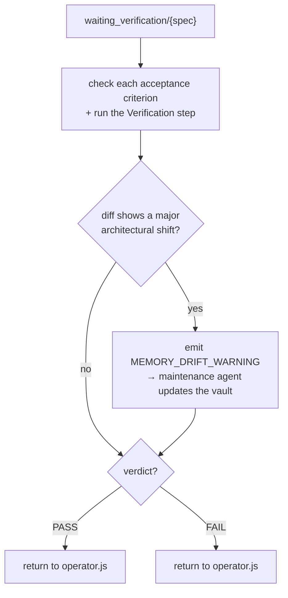

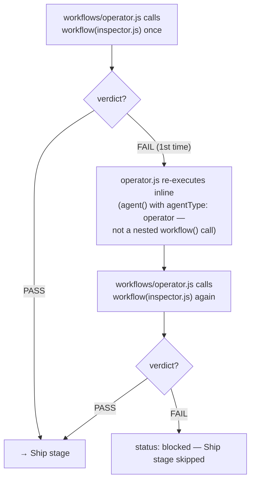

### ⑤ Ship — `workflows/ship.js`, `agentType: shipper` (only ever called after a PASS)

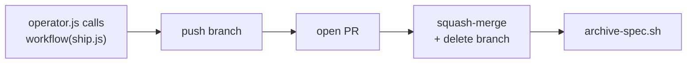

### ⑥ Report — `workflows/operator.js`

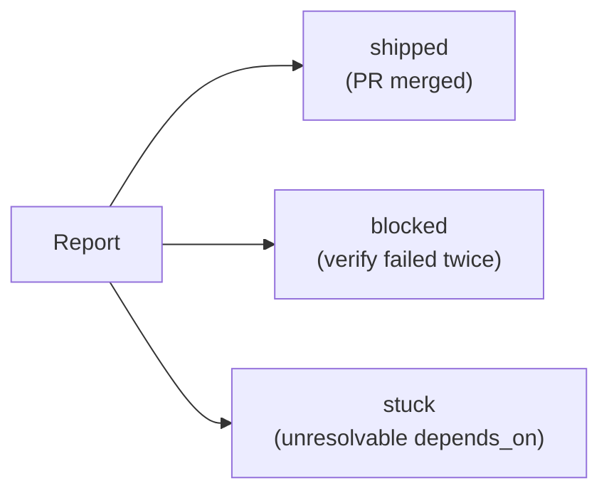

---

## Commands

`/execute` and `/verify` are registered slash commands (`.claude/commands/*.md`). Planning is
now a Skill (`.claude/skills/spec-plan/`) instead of a slash command — it triggers naturally
from conversation (e.g. "let's plan X") rather than needing an explicit invocation. The full
plan→execute pipeline isn't a slash command either — it's the `operator` agent's
**orchestrator mode**, invoked by asking Claude Code to use the `operator` agent (e.g. via the
`Agent` tool with `subagent_type: operator`) with a task description and no spec assigned.

| Invocation | What it does |
|---|---|
| `operator` agent, task description, no spec | Plan once (interactive), then execute all generated specs concurrently with worktree isolation |
| "let's plan X" / "help me design a spec for Y" | Triggers the `spec-plan` skill — collaborative planning session, design a spec before any code is written |
| `/execute [project] [all \| <id> ...]` | Execute one or more ready specs for a project (sequential, no worktrees) |
| `/verify [project] [all \| <id> ...]` | Verify implementation matches requirements; move passing specs to finished |

### `operator` agent — full pipeline

```
Use the operator agent: add user authentication with JWT
```

Runs the Plan phase (interactive, user approves specs) then the Execute phase (`Workflow` tool, concurrent worktree execution). Ends with specs in `waiting_verification/` (under the resolved project's `specs/<project_name>/`) and branches ready to review.

### `/execute` — direct execution

```
/execute template 0001 0002    # execute specific specs in the template project
/execute template all          # execute everything in specs/template/ready/
```

The existing sequential executor — useful when you want to run a single spec or watch each one step-by-step.

---

## Spec Lifecycle

Specs are scoped per project under `specs/<project_name>/` — `specs/template/` for this
harness itself, `specs/<name>/` for a project under `projects/<name>/`. Each project has its
own copy of the lifecycle folders and its own ID sequence:

```
specs/<project_name>/draft/ → ready/ → in_progress/ → waiting_verification/ → finished/
                                          ↓ (if blocked)
                                       blocked/   abandoned/
```

The canonical shape lives in `specs/spec-template.md` (see `specs/README.md` for the full
convention) — each spec is a single `.md` file with YAML frontmatter:

```yaml
---
id: "0001"
title: Add JWT authentication
status: ready
depends_on: []
source: todo.md#anchor-or-section-name
---
## Problem
## Acceptance Criteria
## Out of Scope
## Files/Interfaces Touched
## Implementation Notes
## Verification
```

The `depends_on` array controls execution order — specs with no unmet dependencies run first. IDs of specs in `specs/<project_name>/finished/` are automatically treated as pre-satisfied.

---

## Worktrees

The `operator` agent uses Claude Code's built-in worktree isolation (`isolation: worktree` in the agent frontmatter, and `isolation: 'worktree'` in the Workflow script's `agent()` calls).

Each spec gets a temporary git worktree under `.claude/worktrees/`. The worktree is auto-removed if no changes are committed; if the agent commits work, the worktree (and its branch) persist until you merge or delete it.

If you have gitignored files that should be available in worktrees (e.g. `.env`), list them in `.worktreeinclude`:

```
.env
.env.local
```

---

## Memory

The memory system gives every agent codebase context without re-reading files on each run. It has four layers that serve different purposes, and the system moves through four distinct moments in time — read top to bottom for the full story.

### Overview — four moments in a spec's life

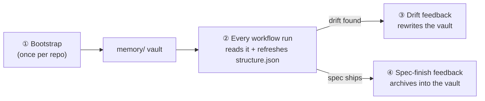

### ① Bootstrap — once per repo

Run after cloning, or after a major architecture change. Fills the vault for the first time; nothing else in the system can run usefully before this.

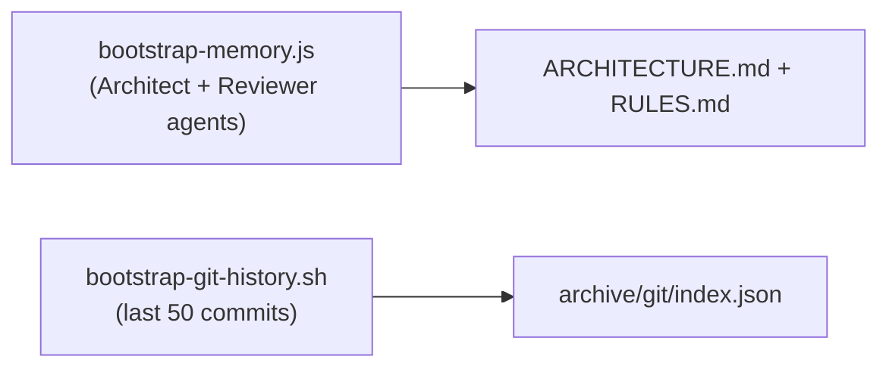

### ② Every workflow run — reads the vault, refreshes the structural index

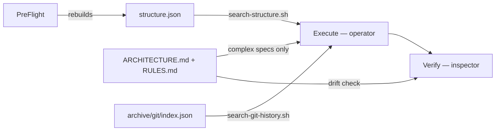

### ③ Drift feedback — inspector finds the vault is stale

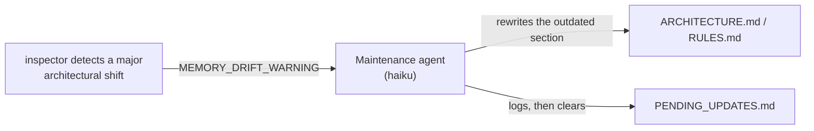

### ④ Spec-finish feedback — a shipped spec becomes history

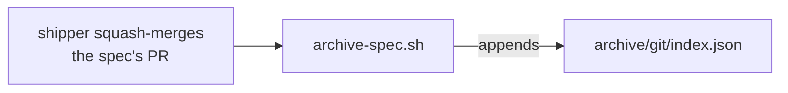

Agents never call these vault files directly — `search-structure.sh`, `search-git-history.sh`, and `read-file-summary.sh`/`write-file-summary.sh` are the query/write interface in front of `structure.json`, the git index, and the per-file summary cache, respectively. See the table below for exactly which script owns which file.

### Memory layers

| Layer | Files | Updated by | Used by |
|---|---|---|---|
| **Semantic** | `ARCHITECTURE.md`, `RULES.md` | `bootstrap-memory.js` (once), maintenance agent (on drift) | operator (complex specs), inspector (drift check) |
| **Structural** | `structure.json` | `build-structure-index.sh` (every pre-flight) | `search-structure.sh` → operator |
| **Episodic** | `archive/git/index.json`, `archive/index.json` | `bootstrap-git-history.sh` (once), `archive-spec.sh` (per finish) | `search-git-history.sh` → operator |
| **Summary cache** | `archive/summaries/*.md` + `*.hash` | `write-file-summary.sh` (agent-driven) | `read-file-summary.sh` → operator |

### Bootstrapping

Run these once after cloning (or after major architecture changes):

```bash
# 1. Index the last 50 git commits
bash scripts/bootstrap-git-history.sh

# 2. Generate structural index of all source files
bash scripts/build-structure-index.sh

# 3. AI-generate ARCHITECTURE.md + RULES.md (runs two agents — requires Claude API)
# Via Claude Code:  /workflow workflows/bootstrap-memory.js
```

The structural index is automatically refreshed before every workflow run (PreFlight step). The git index and semantic files are stable unless the architecture changes significantly — the inspector detects those shifts and a maintenance agent rewrites the affected sections automatically.

### Drift detection

The inspector reads `ARCHITECTURE.md` and `RULES.md` during every verification pass. If it detects a major architectural shift in the diff (new external API, schema change, new service), it emits `MEMORY_DRIFT_WARNING:` in its output. The workflow catches this, spawns a fast maintenance agent (`claude-haiku-4-5-20251001`) to rewrite the outdated sections, then clears the entry from `PENDING_UPDATES.md`.

---

## Design Principles

- **Spec first** — no code before the spec is written and approved
- **One spec = one PR** — sized to fit one feature branch and one review
- **Dependency ordering** — `depends_on` is the only coordination mechanism between specs
- **File-conflict gate** — before approval, every batch of specs is scanned for shared files; any two specs that touch the same file are chained via `depends_on` to prevent merge conflicts during concurrent worktree execution
- **Worktree isolation** — concurrent agents never share a working directory
- **Structured output** — every agent call returns a typed schema, not prose
- **State, not transcripts** — the workflow passes structured data between phases, never raw text
- **Memory over re-reading** — structural index, git history, and AI-generated docs are queried at task time; agents never cold-start without codebase context

---

## What's Planned

The memory system (above) and the operator/inspector/shipper agents have already been re-implemented since the clean-slate reset. Still outstanding — see `REMOVED.md` for the full inventory and reasoning:

- **Hook system** — safety (`pre-bash-safety`, `pre-tool-gatekeeper`, `pre-webfetch-security`), lifecycle (`auto-run-tests`), all currently `hooks/.gitkeep`
- **Telemetry system** — token usage tracking and reporting
- **Research system** — questionnaire-driven multi-iteration web research workflow
- **Shared lib / config schemas / test harness** — `lib/`, `config/schemas/`, `tests/` are still placeholders
