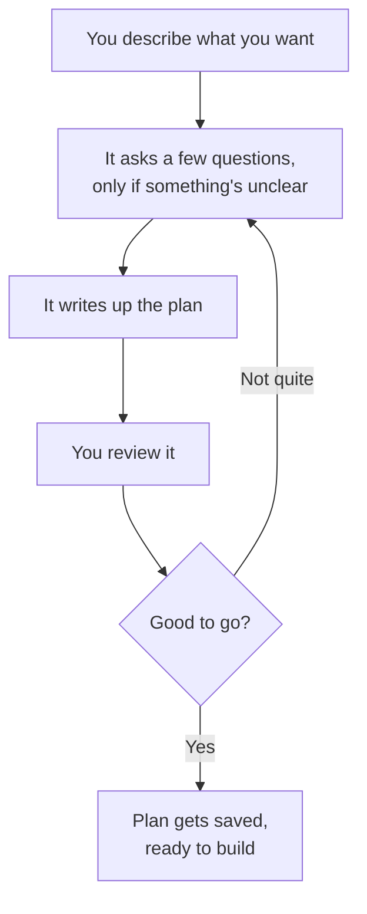
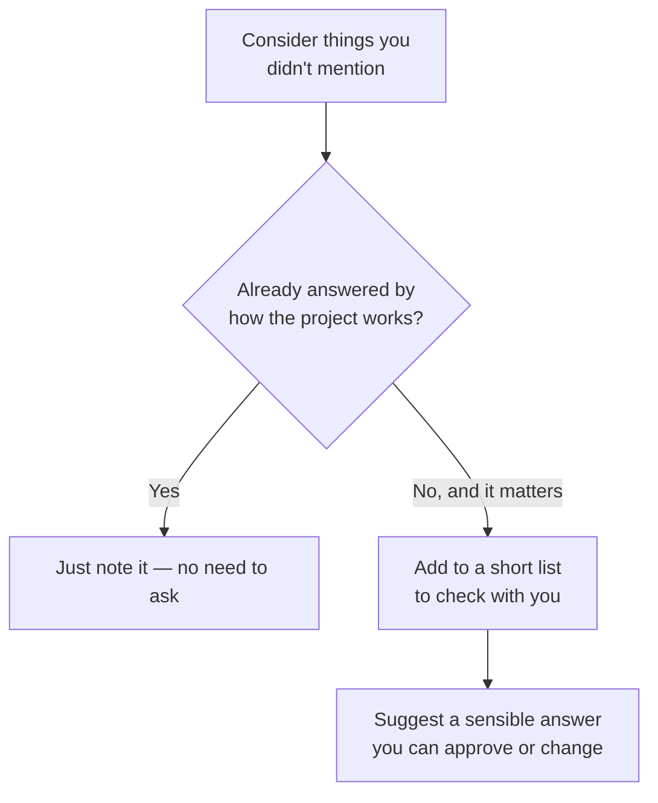
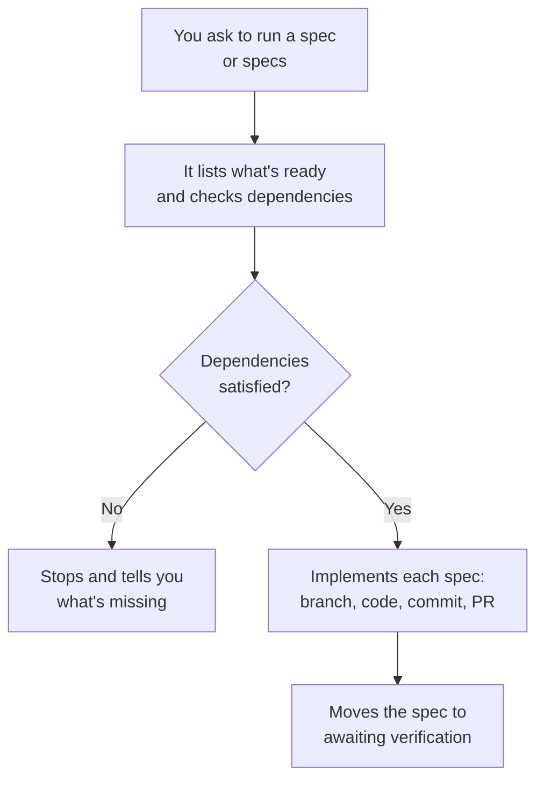

# rig-bench

A clean-slate multi-agent harness for Claude Code. Spec-driven development with a plan→execute pipeline, concurrent worktree-isolated execution, a structured lifecycle for every deliverable, and a persistent memory system that gives every agent codebase context without re-reading files.

---

## What It Is

**rig-bench** gives you a disciplined, end-to-end loop for AI-driven software engineering:

1. **Plan** — design a spec interactively before any code is written
2. **Execute** — implement specs concurrently, each agent in its own git worktree
3. **Verify** — confirm implementation matches requirements before marking as finished
4. **Remember** — structural index, git history, and AI-generated docs persist across runs so agents start informed

The `operator` agent is the core execution primitive. It runs inside an isolated git worktree per spec, creates a feature branch, implements, commits, and advances the spec through the lifecycle — all without touching any other spec's work.

---

## Skills

### `/spec-plan`

> Just a shorthand name — you don't type `/spec-plan`. It kicks in automatically when you
> ask to plan or design something, like saying "let's plan X" or "help me build Y."

Think of it as a thinking partner before any code gets written. Instead of jumping straight
into building, it helps turn your idea into a clear, written-down plan first — then only
starts writing files once you've said "yes, that's right."



For bigger or trickier requests, it also thinks about things you might not have mentioned —
like how something should work on mobile, or what happens if it fails — without turning into
a rigid checklist:



It only asks about things that would actually change how the plan turns out — and when it
does ask, it comes with a suggestion, not a blank question.

---

### `/spec-exec`

> It kicks in when you ask to execute, implement, build, or ship a spec that's already been
> planned and approved, like "let's execute 0001" or "implement the ready specs."

Once a plan exists, this is what turns it into working code. It picks up specs from the
`ready/` folder (or `in_progress/`, if you're resuming something), checks that anything they
depend on is already finished, and then implements them one at a time — each on its own
feature branch, each landing as its own PR.



If two specs you're running at the same time touch the same file, it'll give you a heads-up —
but it won't stop you, since that gate already ran when the specs were approved.

---

## How to Use This Repo

This covers planning and execution — verification will follow the same pattern once its own
docs are written here.

**Planning a new feature or task:**

Just describe what you want in conversation — no special syntax needed:

```
let's plan a rate limiter for the API gateway
```
```
help me design a spec for adding dark mode
```
```
I want to build a webhook retry system — let's think it through first
```

If a project isn't obvious from context and more than one exists under `specs/`, you'll be
asked which one. If you jump straight to "let's build X" for something nontrivial and no spec
exists yet, expect to be offered a planning pass before any code gets written — that's the
skill triggering proactively, not a command you have to remember to invoke.

**What you'll see:** the full drafted spec(s), plus — for anything with real surface area — a
short batch of genuinely open questions (each with a researched recommendation attached)
before drafting finishes. Nothing is written to `specs/<project>/ready/` until you approve it.

**Executing an approved spec:**

Once a spec is sitting in `ready/`, just ask for it:

```
let's execute 0001 for template
```
```
implement all the ready specs
```
```
resume 0003, it got interrupted last time
```

If you don't name specific spec IDs, you'll be shown what's available and asked which to run.
Anything with an unfinished dependency gets blocked with a clear message rather than run
out of order.

---

## Design Principles

- **Spec first** — no code before the spec is written and approved
- **One spec = one PR** — sized to fit one feature branch and one review
- **Dependency ordering** — `depends_on` is the only coordination mechanism between specs
- **File-conflict gate** — before approval, every batch of specs is scanned for shared files; any two specs that touch the same file are chained via `depends_on` to prevent merge conflicts during concurrent worktree execution
- **Worktree isolation** — concurrent agents never share a working directory
- **Structured output** — every agent call returns a typed schema, not prose
- **State, not transcripts** — the workflow passes structured data between phases, never raw text
- **Memory over re-reading** — structural index, git history, and AI-generated docs are queried at task time; agents never cold-start without codebase context
