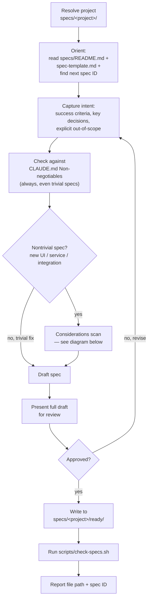
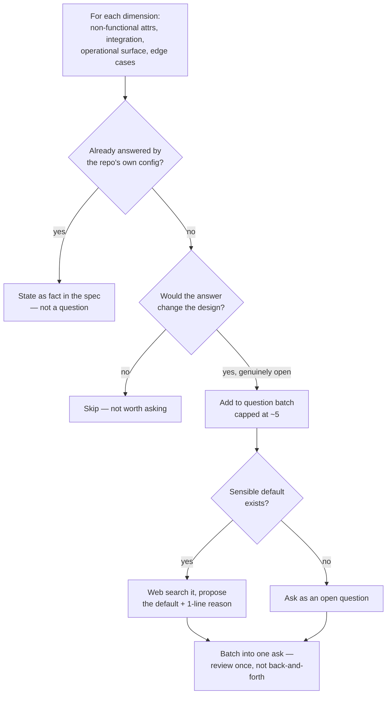

# rig-bench

A clean-slate multi-agent harness for Claude Code. Spec-driven development with a plan→execute pipeline, concurrent worktree-isolated execution, a structured lifecycle for every deliverable, and a persistent memory system that gives every agent codebase context without re-reading files.

---

## What It Is

**rig-bench** gives you a disciplined, end-to-end loop for AI-driven software engineering:

1. **Plan** — design a spec interactively before any code is written
2. **Execute** — implement specs concurrently, each agent in its own git worktree
3. **Verify** — confirm implementation matches requirements before marking as finished
4. **Remember** — structural index, git history, and AI-generated docs persist across runs so agents start informed

The `operator` agent is the core execution primitive. It runs inside an isolated git worktree per spec, creates a feature branch, implements, commits, and advances the spec through the lifecycle — all without touching any other spec's work.

---

## Skills

### `/spec-plan`

> Not a literal slash command — it's a Skill (`.claude/skills/spec-plan/`) that triggers from
> natural conversation ("let's plan X", "help me design a spec for Y") or proactively when you
> jump straight to "let's build X" for anything nontrivial with no spec yet. The `/spec-plan`
> heading here is shorthand for "the planning skill," not something you type literally.

**What it does:** runs a collaborative planning session that produces a docs-level spec
*before* any code is written. The spec — not the code that follows it — is the source of
truth. **No spec file, and no code, gets written before you've approved the plan**;
everything is drafted and shown to you first.

**How it works** — five phases, run in order:



The **considerations scan** (step 4, only for nontrivial specs) is the part worth a second
diagram — it's designed to surface things you didn't think to mention without turning into a
fixed checklist that creates false confidence once a box is ticked:



Each spec follows `specs/spec-template.md`'s shape: `Problem`, `Acceptance Criteria`
(EARS-style, one behavior per sentence), `Out of Scope`, `Files/Interfaces Touched`,
`Implementation Notes`, `Verification`. Multiple unrelated deliverables in one task get split
into separate specs up front, cross-linked via `depends_on`, rather than drafted as one
oversized spec.

---

## How to Use This Repo

For now, this covers planning — execution and verification will follow the same pattern once
their own docs are written here.

**Planning a new feature or task:**

Just describe what you want in conversation — no special syntax needed:

```
let's plan a rate limiter for the API gateway
```
```
help me design a spec for adding dark mode
```
```
I want to build a webhook retry system — let's think it through first
```

If a project isn't obvious from context and more than one exists under `specs/`, you'll be
asked which one. If you jump straight to "let's build X" for something nontrivial and no spec
exists yet, expect to be offered a planning pass before any code gets written — that's the
skill triggering proactively, not a command you have to remember to invoke.

**What you'll see:** the full drafted spec(s), plus — for anything with real surface area — a
short batch of genuinely open questions (each with a researched recommendation attached)
before drafting finishes. Nothing is written to `specs/<project>/ready/` until you approve it.

---

## Design Principles

- **Spec first** — no code before the spec is written and approved
- **One spec = one PR** — sized to fit one feature branch and one review
- **Dependency ordering** — `depends_on` is the only coordination mechanism between specs
- **File-conflict gate** — before approval, every batch of specs is scanned for shared files; any two specs that touch the same file are chained via `depends_on` to prevent merge conflicts during concurrent worktree execution
- **Worktree isolation** — concurrent agents never share a working directory
- **Structured output** — every agent call returns a typed schema, not prose
- **State, not transcripts** — the workflow passes structured data between phases, never raw text
- **Memory over re-reading** — structural index, git history, and AI-generated docs are queried at task time; agents never cold-start without codebase context
