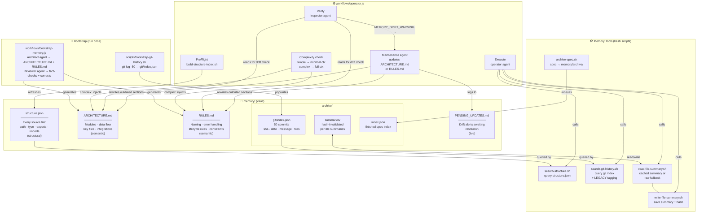

# rig-bench

A clean-slate multi-agent harness for Claude Code. Spec-driven development with a plan→execute pipeline, concurrent worktree-isolated execution, a structured lifecycle for every deliverable, and a persistent memory system that gives every agent codebase context without re-reading files.

---

## What It Is

**rig-bench** gives you a disciplined, end-to-end loop for AI-driven software engineering:

1. **Plan** — design a spec interactively before any code is written
2. **Execute** — implement specs concurrently, each agent in its own git worktree
3. **Verify** — confirm implementation matches requirements before marking as finished
4. **Remember** — structural index, git history, and AI-generated docs persist across runs so agents start informed

The `operator` agent is the core execution primitive. It runs inside an isolated git worktree per spec, creates a feature branch, implements, commits, and advances the spec through the lifecycle — all without touching any other spec's work.

---

## Repository Layout

```
rig-bench/
├── .claude/
│   ├── agents/
│   │   ├── operator.md       # Plan + implement (orchestrator or per-spec worker)
│   │   ├── inspector.md      # Verification + drift detection (worktree-isolated, read-only)
│   │   └── shipper.md        # PR creation (worktree-isolated, push+PR)
│   ├── commands/
│   │   ├── plan.md           # /plan    — interactive spec authoring
│   │   ├── execute.md        # /execute — execute one or more ready specs
│   │   └── verify.md         # /verify  — verify waiting specs against their criteria
│   └── settings.json         # Permissions
├── workflows/
│   ├── operator.js           # Concurrent execution workflow (pipeline + worktrees)
│   └── bootstrap-memory.js   # One-shot AI memory generation (Architect + Reviewer agents)
├── scripts/
│   ├── bootstrap-git-history.sh   # Index last 50 commits → memory/archive/git/index.json
│   ├── build-structure-index.sh   # Scan repo exports/imports → memory/structure.json
│   ├── search-structure.sh        # Query structural index (used by operator)
│   ├── search-git-history.sh      # Query git history index with LEGACY tagging
│   ├── read-file-summary.sh       # Read cached file summary (hash-invalidated)
│   ├── write-file-summary.sh      # Write file summary to cache
│   ├── read-worktree-diff.sh      # Print diff vs main, truncated to 10k lines
│   └── archive-spec.sh            # Archive a finished spec into memory/archive/
├── memory/                   # Persistent memory vault
│   ├── ARCHITECTURE.md       # AI-generated system architecture (semantic memory)
│   ├── RULES.md              # AI-generated coding standards (semantic memory)
│   ├── PENDING_UPDATES.md    # Drift alerts awaiting resolution
│   ├── structure.json        # Structural index of all source files
│   └── archive/
│       ├── git/index.json    # Git commit history (last 50, with LEGACY tagging)
│       ├── index.json        # Index of archived finished specs
│       └── summaries/        # Hash-invalidated file summary cache
├── specs/                    # Spec lifecycle folders
│   ├── draft/                # Being written; may have [NEEDS CLARIFICATION] markers
│   ├── ready/                # All ambiguity resolved; ready to execute
│   ├── in_progress/          # Actively being implemented
│   ├── waiting_verification/ # Implementation complete; awaiting human confirmation
│   ├── finished/             # Shipped — merged PR is the permanent record
│   ├── blocked/              # Waiting on a dependency or decision
│   └── abandoned/            # Won't do; kept for reference
├── hooks/                    # Reserved for lifecycle hooks
├── lib/                      # Reserved for shared libraries
├── config/schemas/           # Reserved for JSON schemas
├── tests/                    # Reserved for test harness
└── projects/                 # Standalone project repos (each is its own git repo)
```

---

## Agents

Three agents, each with a focused role:

| Agent | File | Role | Model | Isolation |
|---|---|---|---|---|
| `operator` | `.claude/agents/operator.md` | Plans and implements specs — orchestrator when invoked top-level, implementer when spawned per-spec | Sonnet | worktree |
| `inspector` | `.claude/agents/inspector.md` | Verifies implementation against acceptance criteria (read-only) | Sonnet | worktree |
| `shipper` | `.claude/agents/shipper.md` | Pushes the verified branch and opens a draft PR | Haiku | worktree |

### operator

Two modes, one agent:

**Orchestrator mode** (invoked with a task description):
1. **Plan phase** — follows `/plan` command logic: reads `specs/README.md`, finds the next spec ID, captures intent with the user via `AskUserQuestion`, drafts specs, gets user approval, writes them to `specs/ready/`
2. **Execute phase** — follows `/execute` command logic: validates dependencies, then invokes `workflows/operator.js` which fans out concurrent per-spec execution — each spec runs in its own worktree via a fresh operator spawn

**Implement mode** (spawned by the workflow with a specific spec):
1. Creates a feature branch (`{id}-{slug}`)
2. Moves spec `ready/ → in_progress/` and commits
3. Reads the spec, implements all acceptance criteria
4. Commits the implementation (staged explicitly, never `git add -A`)
5. Moves spec `in_progress/ → waiting_verification/`, updates status frontmatter
6. Returns: `spec_id`, `status`, `branch`, `summary`, `errors`

### inspector

1. Checks out the feature branch in its worktree
2. Reads the spec from `specs/waiting_verification/{filename}`
3. Checks each EARS-style acceptance criterion — finds the specific code (file:line) that satisfies it
4. Runs the `Verification` step from the spec
5. Returns: `spec_id`, `verdict` (PASS/FAIL), `criteria_results[]`, `failures[]`

### shipper

1. Checks out the feature branch in its worktree
2. Reads the spec to extract title and acceptance criteria
3. Pushes the branch: `git push origin {branch}`
4. Opens a draft PR: `gh pr create --draft` with spec criteria as the body
5. Returns: `spec_id`, `status`, `pr_url`, `branch`

---

## The Operator Workflow

`workflows/operator.js` orchestrates the full pipeline. Each spec flows through three stages concurrently within a dependency wave:

```
Discover
  ↓ read specs/ready/, build dependency graph, classify each spec simple/complex

PreFlight
  ↓ run build-structure-index.sh to refresh memory/structure.json

Wave N (all specs in this wave run concurrently via pipeline())
  ↓
  Stage 1 — Execute (operator, worktree)
    classify complexity → inject memory context if complex (RULES.md + ARCHITECTURE.md)
    create branch → implement → commit → move spec to waiting_verification/
    checkpoint: if context fills, write PROGRESS.md and resume (up to 3×)
  ↓
  Stage 2 — Verify (inspector, worktree)
    read diff first (read-worktree-diff.sh) → check criteria → run verification step
    drift check: compare diff against ARCHITECTURE.md/RULES.md
      drift found → emit MEMORY_DRIFT_WARNING → maintenance agent updates memory files
      PASS → continue
      FAIL → retry: re-execute (operator) → re-verify (inspector)
               PASS → continue
               FAIL → status=blocked, skip Stage 3

  Stage 3 — Merge (shipper, worktree)
    checkout branch → git push → gh pr create --draft

Report
  ↓ shipped (PR open) / blocked (verify failed) / stuck (unresolvable deps)
```

Specs with no dependency relationship run **concurrently** in the same wave. Specs in later waves start only after all specs in the previous wave complete. Set `depends_on` in spec frontmatter to control ordering.

---

## Commands

| Command | What it does |
|---|---|
| `/operator <task>` | Plan once (interactive), then execute all generated specs concurrently with worktree isolation |
| `/plan <task>` | Collaborative planning session — design a spec before any code is written |
| `/execute [all \| <id> ...]` | Execute one or more ready specs (sequential, no worktrees) |
| `/verify [all \| <id> ...]` | Verify implementation matches requirements; move passing specs to finished |

### `/operator` — full pipeline

```
/operator add user authentication with JWT
```

Runs Phase 1 (plan, interactive, user approves specs) then Phase 2 (Workflow tool, concurrent worktree execution). Ends with specs in `waiting_verification/` and branches ready to review.

### `/execute` — direct execution

```
/execute 0001 0002    # execute specific specs
/execute all          # execute everything in specs/ready/
```

The existing sequential executor — useful when you want to run a single spec or watch each one step-by-step.

---

## Spec Lifecycle

```
draft/ → ready/ → in_progress/ → waiting_verification/ → finished/
                     ↓ (if blocked)
                  blocked/   abandoned/
```

Each spec is a single `.md` file with YAML frontmatter:

```yaml
---
id: 0001
title: Add JWT authentication
status: ready
depends_on: []
---
## Problem
## Acceptance Criteria
## Out of Scope
## Files / Interfaces Touched
## Implementation Plan
## Verification
```

The `depends_on` array controls execution order — specs with no unmet dependencies run first. IDs of specs in `specs/finished/` are automatically treated as pre-satisfied.

---

## Worktrees

The `operator` agent uses Claude Code's built-in worktree isolation (`isolation: worktree` in the agent frontmatter, and `isolation: 'worktree'` in the Workflow script's `agent()` calls).

Each spec gets a temporary git worktree under `.claude/worktrees/`. The worktree is auto-removed if no changes are committed; if the agent commits work, the worktree (and its branch) persist until you merge or delete it.

If you have gitignored files that should be available in worktrees (e.g. `.env`), list them in `.worktreeinclude`:

```
.env
.env.local
```

---

## Memory

The memory system gives every agent codebase context without re-reading files on each run. It has four layers that serve different purposes:



### Memory layers

| Layer | Files | Updated by | Used by |
|---|---|---|---|
| **Semantic** | `ARCHITECTURE.md`, `RULES.md` | `bootstrap-memory.js` (once), maintenance agent (on drift) | operator (complex specs), inspector (drift check) |
| **Structural** | `structure.json` | `build-structure-index.sh` (every pre-flight) | `search-structure.sh` → operator |
| **Episodic** | `archive/git/index.json`, `archive/index.json` | `bootstrap-git-history.sh` (once), `archive-spec.sh` (per finish) | `search-git-history.sh` → operator |
| **Summary cache** | `archive/summaries/*.md` + `*.hash` | `write-file-summary.sh` (agent-driven) | `read-file-summary.sh` → operator |

### Bootstrapping

Run these once after cloning (or after major architecture changes):

```bash
# 1. Index the last 50 git commits
bash scripts/bootstrap-git-history.sh

# 2. Generate structural index of all source files
bash scripts/build-structure-index.sh

# 3. AI-generate ARCHITECTURE.md + RULES.md (runs two agents — requires Claude API)
# Via Claude Code:  /workflow workflows/bootstrap-memory.js
```

The structural index is automatically refreshed before every workflow run (PreFlight step). The git index and semantic files are stable unless the architecture changes significantly — the inspector detects those shifts and a maintenance agent rewrites the affected sections automatically.

### Drift detection

The inspector reads `ARCHITECTURE.md` and `RULES.md` during every verification pass. If it detects a major architectural shift in the diff (new external API, schema change, new service), it emits `MEMORY_DRIFT_WARNING:` in its output. The workflow catches this, spawns a fast maintenance agent (`claude-haiku-4-5-20251001`) to rewrite the outdated sections, then clears the entry from `PENDING_UPDATES.md`.

---

## Design Principles

- **Spec first** — no code before the spec is written and approved
- **One spec = one PR** — sized to fit one feature branch and one review
- **Dependency ordering** — `depends_on` is the only coordination mechanism between specs
- **File-conflict gate** — before approval, every batch of specs is scanned for shared files; any two specs that touch the same file are chained via `depends_on` to prevent merge conflicts during concurrent worktree execution
- **Worktree isolation** — concurrent agents never share a working directory
- **Structured output** — every agent call returns a typed schema, not prose
- **State, not transcripts** — the workflow passes structured data between phases, never raw text
- **Memory over re-reading** — structural index, git history, and AI-generated docs are queried at task time; agents never cold-start without codebase context

---

## What's Planned

See `REMOVED.md` for the full inventory of systems stripped during the clean-slate reset, and their intended re-implementations:

- Hook system (safety, telemetry, lifecycle)
- Token telemetry
