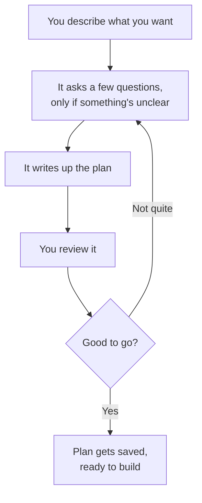
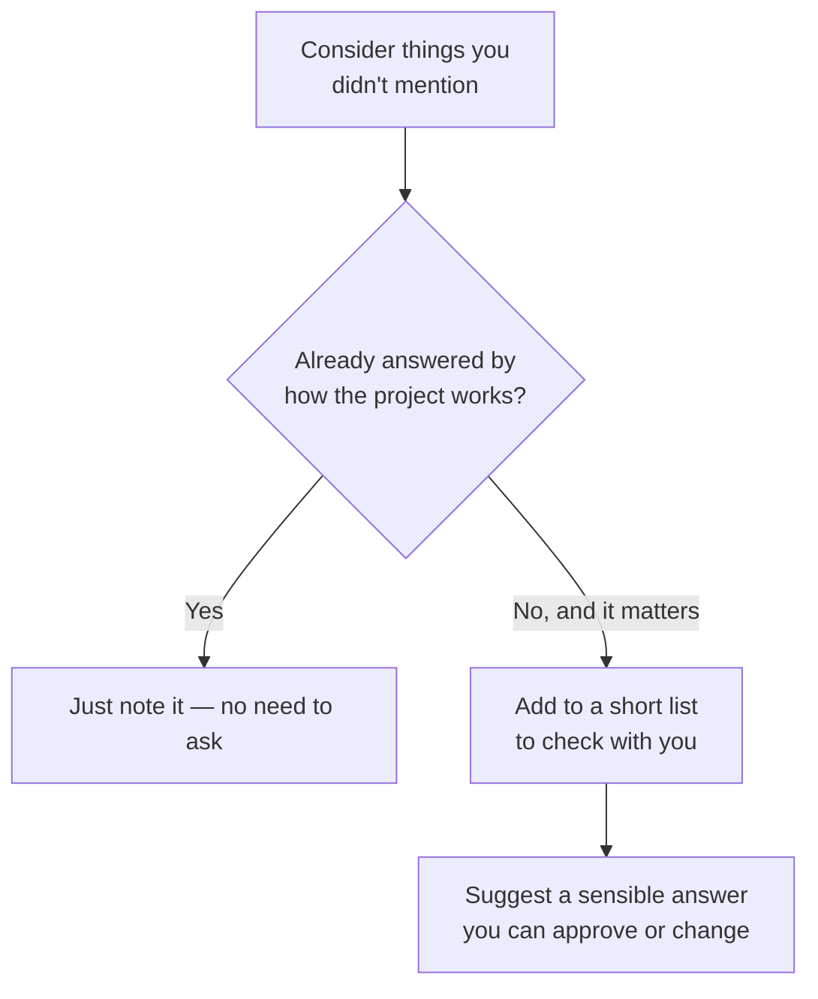
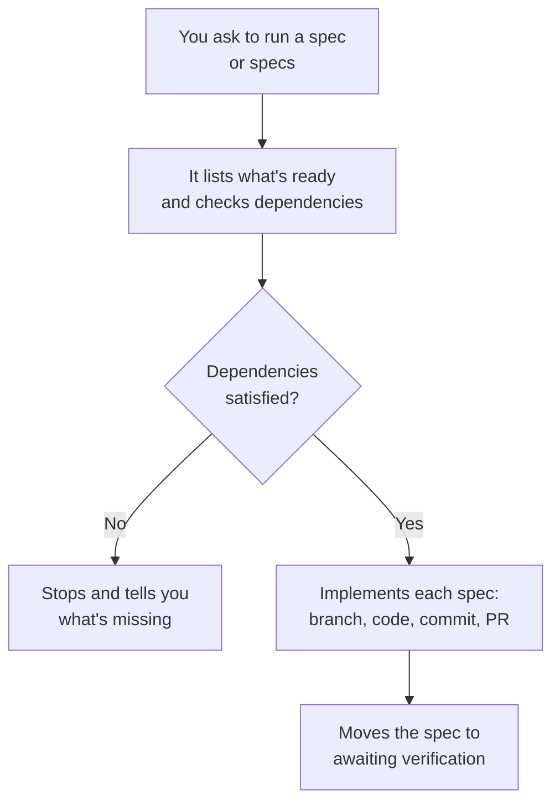
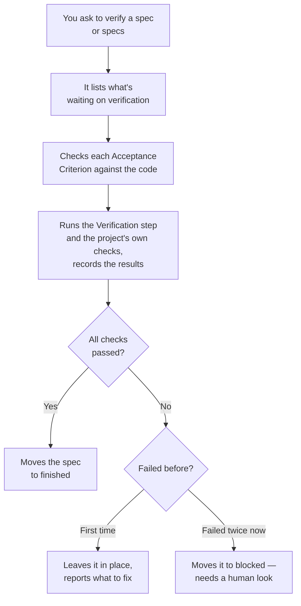

# rig-bench

A clean-slate multi-agent harness for Claude Code. Spec-driven development with a plan→execute pipeline, concurrent worktree-isolated execution, and a structured lifecycle for every deliverable.

---

## What It Is

**rig-bench** gives you a disciplined, end-to-end loop for AI-driven software engineering:

1. **Plan** — design a spec interactively before any code is written
2. **Execute** — implement specs concurrently, each agent in its own git worktree
3. **Verify** — confirm implementation matches requirements before marking as finished

---

## Skills

### `/spec-plan`

> You don't type `/spec-plan` — it kicks in automatically when you ask to plan or design
> something, like saying "let's plan X" or "help me build Y."

Think of it as a thinking partner before any code gets written. Instead of jumping straight
into building, it helps turn your idea into a clear, written-down plan first — then only
starts writing files once you've said "yes, that's right."



For bigger or trickier requests, it also thinks about things you might not have mentioned —
like how something should work on mobile, or what happens if it fails — without turning into
a rigid checklist:



It only asks about things that would actually change how the plan turns out — and when it
does ask, it comes with a suggestion, not a blank question.

Each spec also has to earn its shape: a stated "if this ships, X should happen" claim, one
mechanism per spec (an "and also..." is a second spec, not a paragraph), a named source when
the design borrows from a paper or another project, and a glance at the outcome ledger so
you don't re-draft something that already shipped — or already got stuck.

---

### `/spec-exec`

> It kicks in when you ask to execute, implement, build, or ship a spec that's already been
> planned and approved, like "let's execute 0001" or "implement the ready specs."

Once a plan exists, this is what turns it into working code. It picks up specs from the
`ready/` folder (or `in_progress/`, if you're resuming something), checks that anything they
depend on is already finished, and then implements them one at a time — each on its own
feature branch, each landing as its own PR.



If two specs you're running at the same time touch the same file, it'll give you a heads-up —
but it won't stop you, since that gate already ran when the specs were approved.

When a spec introduces a mechanism the repo doesn't already have, the implementation starts
with a throwaway prototype in `/tmp` — validate the core idea against real inputs first,
then build it properly. Wiring-only specs skip straight to implementation.

---

### `/spec-verify`

> It kicks in when you ask to verify, check, or confirm a spec, like "verify 0001" or "is the
> waiting stuff ready to ship."

Once a spec has been implemented, this is what checks the work actually matches what was
asked for. It reads each spec's Acceptance Criteria and Verification step, checks the code
against them one by one, and only moves a spec to `finished/` if everything passes.



Nothing gets marked finished on a partial pass — if even one criterion fails, or the
project's own checks (`make check`, the test suite) break, the spec stays put and you get a
clear list of what still needs fixing, plus a raw trace of exactly what ran and what it
printed (`scripts/spec-trace.sh`) for the fix to work from. Outcomes land in an append-only
ledger (`scripts/spec-ledger.sh list`) so later planning can see what shipped and what got
stuck. Fail the same spec twice and it stops
looping silently: it moves to a `blocked/` folder instead, so a spec can't sit forgotten in
limbo forever without anyone noticing.

---

## How to Use This Repo

This covers planning, execution, and verification — the three phases of the spec lifecycle,
in order.

**Planning a new feature or task:**

Just describe what you want in conversation — no special syntax needed:

```
let's plan a rate limiter for the API gateway
```
```
help me design a spec for adding dark mode
```
```
I want to build a webhook retry system — let's think it through first
```

If a project isn't obvious from context and more than one exists under `specs/`, you'll be
asked which one. If you jump straight to "let's build X" for something nontrivial and no spec
exists yet, expect to be offered a planning pass before any code gets written — that's the
skill triggering proactively, not a command you have to remember to invoke.

**What you'll see:** the full drafted spec(s), plus — for anything with real surface area — a
short batch of genuinely open questions (each with a researched recommendation attached)
before drafting finishes. Nothing is written to `specs/<project>/ready/` until you approve it.

**Executing an approved spec:**

Once a spec is sitting in `ready/`, just ask for it:

```
let's execute 0001 for template
```
```
implement all the ready specs
```
```
resume 0003, it got interrupted last time
```

If you don't name specific spec IDs, you'll be shown what's available and asked which to run.
Anything with an unfinished dependency gets blocked with a clear message rather than run
out of order.

**Verifying an implemented spec:**

Once a spec is sitting in `waiting_verification/`, just ask for it:

```
verify 0001 for template
```
```
is the waiting_verification stuff ready to ship?
```
```
did 0003 actually meet its acceptance criteria?
```

If you don't name specific spec IDs, you'll be shown what's waiting and asked which to check.
Each spec's Acceptance Criteria and Verification step are checked against the actual code —
not assumed from the implementation report — and only a full pass moves a spec to `finished/`.

A spec that fails stays in `waiting_verification/` with a clear list of what's still wrong, so
you can ask `spec-exec` to fix it directly:

```
fix 0001 — the rate limiter isn't returning 429s under load
```

Fail the same spec twice and it won't loop silently: it moves to `blocked/` instead, and needs
a human decision before another attempt.

---

**Spec documents and git:**

Spec files are local working state and are never committed — the lifecycle
(plan→execute→verify, the retry contract, traces) runs entirely from disk, PRs carry
implementation changes only, and the append-only outcome ledger
(`scripts/spec-ledger.sh list`) records what finished or got blocked on each machine.

---

## Design Principles

- **Spec first** — no code before the spec is written and approved
- **One spec = one PR** — sized to fit one feature branch and one review
- **Dependency ordering** — `depends_on` is the only coordination mechanism between specs
- **File-conflict gate** — before approval, every batch of specs is scanned for shared files; any two specs that touch the same file are chained via `depends_on` to prevent merge conflicts during concurrent worktree execution
- **Worktree isolation** — concurrent agents never share a working directory
- **Prose + data, no orchestration code** — the lifecycle procedure lives in the skills' prose and `workflows/state.yaml` carries the structural facts; there is deliberately no workflow-engine layer (see `memory/decisions.md`)
- **Checks are enforced** — `make check` (state-table sync + per-spec consistency) and `npm test` run in CI on every PR
