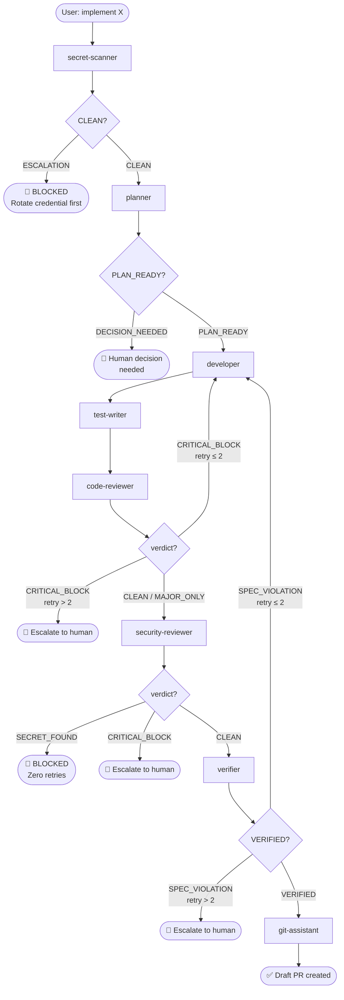
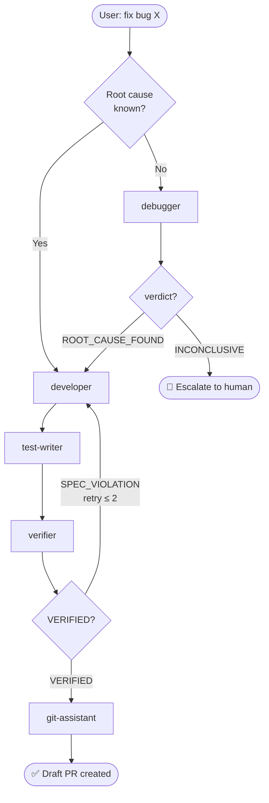
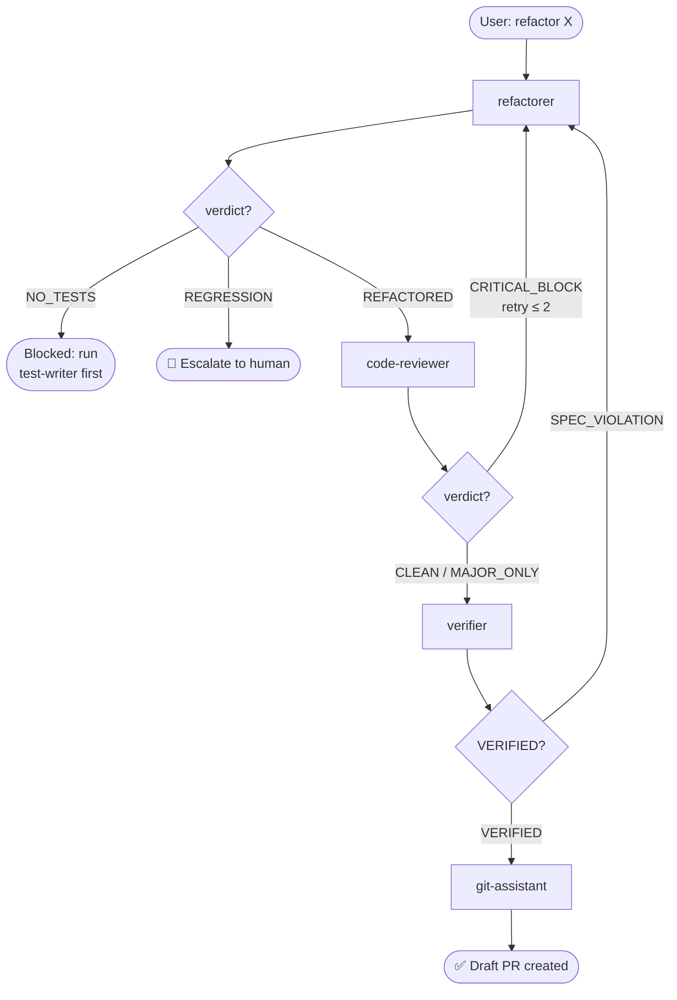
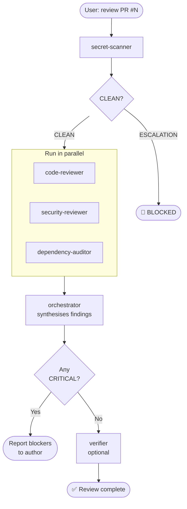
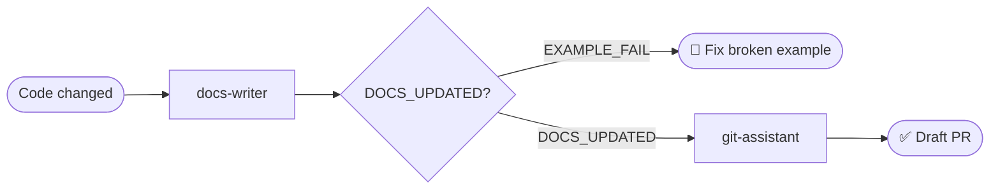
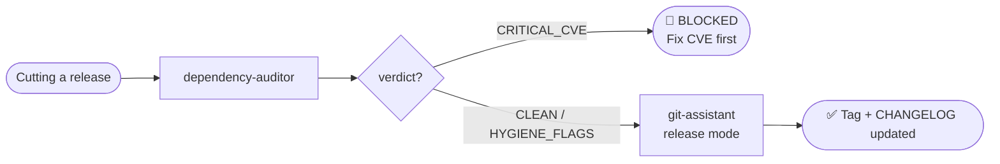

# Agent Harness

A set of Claude Code subagents covering the full engineering cycle — from understanding a requirement to opening a reviewed, tested, and secure pull request.

Each agent is a self-contained `.md` file with a YAML header and a system prompt. Drop any of them into `.claude/agents/` and Claude Code picks them up automatically.

---

## How it works

### 1. You describe the task

You type a goal in Claude Code — "implement per-tenant rate limiting" or "review PR #42 before I merge it".

### 2. The orchestrator selects and sequences agents

The **orchestrator** reads the request, picks the right pipeline from its built-in chains, and dispatches each specialist agent one at a time — passing a synthesized prompt (never raw output) to each stage.

### 3. Each agent does one job

Every agent:
- Has a defined role and tool list enforced at runtime
- Follows a numbered step procedure
- Emits a structured `<task-notification>` XML block at the end so the orchestrator knows the verdict

### 4. Quality gates enforce correctness

Before advancing to the next stage, the orchestrator reads the `<task-notification>` verdict. A `CRITICAL_BLOCK` from code-reviewer or a `SPEC_VIOLATION` from verifier loops the pipeline back to developer with specific `file:line` fix instructions. A `SECRET_FOUND` stops everything with zero retries.

### 5. The PR arrives clean

git-assistant creates a draft PR only after every gate has passed.

---

## Installation

```bash
# Copy a single agent
cp agents/developer/developer.md your-project/.claude/agents/developer.md

# Copy all agents at once
mkdir -p your-project/.claude/agents
for f in agents/*/; do
  name=$(basename "$f")
  cp "agents/$name/$name.md" "your-project/.claude/agents/$name.md"
done
```

Claude Code picks up any `.md` file in `.claude/agents/` automatically — no config needed.

---

## Where to start

**New to this?** Start with the orchestrator. Say `"implement X end to end"` or `"review PR #N"` and it handles the rest.

**Want deterministic, resumable pipelines?** Use the [workflow scripts](../workflows/README.md) — same pipelines as the orchestrator but controlled by code instead of a model.

**Comfortable with individual agents?** Call any agent directly — each is fully self-contained and works without the orchestrator.

---

## Agents at a glance

| Agent | Role | Permission | Model |
|---|---|---|---|
| [memory-manager](#memory-manager) | Reads/writes `.claude/memory/` — project knowledge store | `semi-auto` | Haiku |
| [orchestrator](#orchestrator) | Pipeline conductor — sequences all other agents | `auto` | Sonnet |
| [planner](#planner) | Produces a concrete, file-level implementation plan | `auto` | Sonnet |
| [developer](#developer) | Implements features, bug fixes, refactors | `manual` | Sonnet |
| [test-writer](#test-writer) | Writes and verifies tests (AAA, TDD) | `semi-auto` | Sonnet |
| [refactorer](#refactorer) | Restructures code without changing behavior | `semi-auto` | Sonnet |
| [code-reviewer](#code-reviewer) | Two-pass code review with 4 effort modes | `semi-auto` | Sonnet |
| [security-reviewer](#security-reviewer) | OWASP A01–A10 + STRIDE audit | `semi-auto` | Sonnet |
| [secret-scanner](#secret-scanner) | Fast SEC-4 credential scan (target <10 sec) | `semi-auto` | Haiku |
| [dependency-auditor](#dependency-auditor) | CVE scan, license check, version hygiene | `semi-auto` | Sonnet |
| [verifier](#verifier) | Binary spec-compliance check with real evidence | `semi-auto` | Sonnet |
| [debugger](#debugger) | Root-cause analysis, never applies fixes | `semi-auto` | Sonnet |
| [docs-writer](#docs-writer) | Keeps README, CLAUDE.md, docstrings in sync | `semi-auto` | Sonnet |
| [git-assistant](#git-assistant) | Conventional commits, draft PRs, branch safety | `manual` | Sonnet |
| [changelog-writer](#changelog-writer) | CHANGELOG.md entries in Keep a Changelog format | `semi-auto` | Sonnet |

---

## Pipelines

### New feature



---

### Bug fix



---

### Refactor



---

### PR quality review



---

### Docs update



---

### Release prep



---

## Agent details

### memory-manager

**Role:** Project knowledge store. Reads `.claude/memory/` to give agents context before a run (LOAD), and writes findings after a run (SAVE). Runs on Haiku for speed — it's called at the start and end of every pipeline.

**Operations:** `LOAD` (context brief before a task) · `SAVE` (record findings after a run) · `UPDATE` (revise a stale entry) · `QUERY` (answer a specific question from memory)

**Memory files managed:**

| File | Contains |
|---|---|
| `conventions.md` | Coding patterns, idioms, style rules |
| `architecture.md` | Module structure, data flow, key invariants |
| `gotchas.md` | Things that broke, edge cases, surprises |
| `lessons-learned.md` | Agent run outcomes, retry patterns |
| `decisions.md` | Architectural choices and rationale |

**Call it with:** `"remember that this project uses table-driven tests"` · `"what do we know about the cache layer?"` · runs automatically at start/end of `new-feature` and `bug-fix` workflows.

---

### orchestrator

**Role:** Pipeline conductor. Decides which chain to run, dispatches each agent with a synthesized prompt (including specific `file:line` references from prior stages), enforces quality gates, and escalates to you only when automation is exhausted.

**Key behaviors:**
- **Mandatory synthesis step** — before every dispatch, reads the prior agent's `<task-notification>` XML and `## HANDOFF` YAML, extracts `file:line` findings, and builds a targeted `<synthesis>` XML block. Never pipes raw output forward.
- **Per-stage retry counter** — max 2 retries per stage (3 total attempts), then escalates to you with the full attempt history.
- **SECRET_FOUND zero retries** — any secret escalation immediately stops the pipeline. Resume only after you confirm `RESOLVED`, `ACCEPTED-RISK`, or `ABORT`.

**Call it with:** `"implement X end to end"` · `"review PR #N before I merge"` · `"fix this bug and get it to a PR"`

---

### planner

**Role:** Read-only. Reads the codebase, asks at most 2–3 targeted clarifying questions, and produces a phased, file-level implementation plan. Never writes code.

**Output includes:** files to touch, files NOT to touch, implementation steps with `file:line`, risk flags, decisions needed.

**Call it when:** task touches 3+ files, has architecture decisions, or you want a blueprint before writing any code.

---

### developer

**Role:** Implements features, bug fixes, and refactors following TDD (Red → Green → Refactor). Runs a two-stage self-validation gate (spec compliance, then code quality) and requires real test output before reporting done.

**Languages:** Go, TypeScript/JavaScript, Python, Rust, .NET

**Hard rules:** never pushes directly except initial `git push -u`; never uses `git add .`; always on a feature branch.

---

### test-writer

**Role:** Writes tests in AAA pattern (Arrange / Act / Assert). Maps every code path — happy path, error paths, boundary conditions, concurrency — before writing a single test. Verifies every test actually fails before the implementation (Red) and passes after (Green).

**Coverage targets:** 95% business logic · 85% application layer · 80% infrastructure

---

### refactorer

**Role:** Restructures working code without changing external behavior. Requires a passing test baseline before starting. Refactors one smell at a time, runs tests after each change, commits each independently.

**Refuses to start when:** no tests exist (hands off to test-writer) · tests are already failing · the task is about to delete the code.

---

### code-reviewer

**Role:** Two-pass review with 4 effort modes. Pass A = spec compliance. Pass B = quality audit across correctness, security (STRIDE), code quality, test coverage, and performance.

**Effort modes:**

| Mode | Tool budget | Use for |
|---|---|---|
| `low` | ≤12 calls | Small PRs, config-only changes |
| `medium` | ≤25 calls | Default — feature PRs, bug fixes |
| `high` | ≤40 calls | Auth, API, security-sensitive code |
| `maximum` | ≤60 calls | Pre-release, critical paths, post-incident |

Call with: `"review with effort=high"` to override the default.

---

### security-reviewer

**Role:** Full security audit — OWASP A01–A10, STRIDE threat model, real grep patterns for 7 secret types, dependency vulnerability check. Every finding cites `file:line` with a concrete attack scenario and severity justification.

**SEC-4 escalation:** any hardcoded secret (AWS key, GitHub token, JWT, private key, DB URI, high-entropy generic) → pipeline stops immediately, human must rotate and clean history before resuming.

---

### secret-scanner

**Role:** Fast, focused first gate. Runs 8 grep patterns from the SEC-4 protocol against changed files only. Designed to run in under 10 seconds before any other analysis agent starts.

**Why a separate agent from security-reviewer?** Speed and scope. secret-scanner checks only the diff for credentials in seconds — it doesn't read full files, audit dependencies, or do OWASP analysis. Use it as a cheap always-on first gate; use security-reviewer for the full audit.

**Verdicts:** `CLEAN` → pipeline proceeds · `ESCALATION` → pipeline blocked, zero retries.

---

### dependency-auditor

**Role:** Scans every package manifest (npm, Go modules, pip, Rust, .NET, Ruby, Maven) for CVEs, unpinned versions, missing lock files, abandoned packages, and license conflicts. Every finding includes the exact command to fix it.

**Multi-ecosystem:** works across all ecosystems in one pass. Deduplicates: the same CVE in 3 workspaces = 1 finding.

---

### verifier

**Role:** Independent spec-compliance check — does the implementation actually do what was asked? Returns binary `VERIFIED` or `SPEC_VIOLATION` with real execution evidence (test output, grep results, curl responses) for every stated requirement. Never trusts the developer agent's self-report.

**PARTIAL counts as SPEC_VIOLATION** — every requirement must be fully MET for a VERIFIED verdict.

---

### debugger

**Role:** Root-cause analysis only. Reproduces the failure, forms 2–3 ranked hypotheses, tests the cheapest ones first, and produces a diagnosis with a suggested fix snippet. Never applies the fix.

**Anti-sycophancy rule:** if evidence disproves the caller's hypothesis, states the actual cause and cites the disconfirming `file:line`.

**Time-boxed** at ~10 tool calls. Reports partial findings if not converged — never spins.

---

### docs-writer

**Role:** Keeps documentation in sync with code. Verifies every code example it writes actually runs. Archives stale docs with `git mv` (never deletes). Does not touch CHANGELOG.md — routes that to git-assistant.

**Checks after writing:** function names, config keys, CLI flags, and env var names all verified against the actual source.

---

### git-assistant

**Role:** Git safety officer. Validates conventional commit messages, checks branch hygiene before touching anything, creates draft PRs with a structured body template. Routes CHANGELOG updates to changelog-writer.

**Hard rules:** no `git push --force`; no `git push --force-with-lease`; no direct push to `main`/`master`; no `git add .`; PRs always start as drafts.

---

### changelog-writer

**Role:** CHANGELOG.md specialist. Reads recent commits and PR descriptions, classifies them into Keep a Changelog sections (Added / Changed / Fixed / Removed / Security), and writes user-facing entries. Filters out dev-internal commits (tests, CI, chores). Handles both `[Unreleased]` entries and named version releases.

**Does NOT touch:** source code, tests, or any other docs file.

**Routing:** git-assistant routes changelog work here; docs-writer also routes here when CHANGELOG.md would otherwise be skipped.

---

## Communication protocol

Every agent ends its response with two structured blocks that the orchestrator reads:

### `<task-notification>` — completion signal

```xml
<task-notification>
  <agent>code-reviewer</agent>
  <status>done</status>
  <verdict>CRITICAL_BLOCK</verdict>
  <effort-mode>medium</effort-mode>
  <finding-count total="2" critical="1" major="1" minor="0"/>
  <blocking>true</blocking>
  <artifacts>
    <artifact>Pass A (spec compliance): PASS</artifact>
    <artifact>Pass B (quality): 2 findings</artifact>
  </artifacts>
  <summary>1 Critical finding blocks merge. SQL injection at handler.go:88.</summary>
  <pipeline-gate>BLOCK</pipeline-gate>
</task-notification>
```

The orchestrator parses `<verdict>` and `<pipeline-gate>` to decide whether to advance, loop back, or escalate. If `<task-notification>` is absent or malformed — treated as `BLOCK`.

### `## HANDOFF` — data for the next agent

```yaml
agent: code-reviewer
status: BLOCKED
task_id: "feat-rate-limit-001"
artifacts:
  - "Spec compliance: PASS"
  - "Quality findings: 1 critical, 1 major"
findings:
  - severity: Critical
    file: "internal/handler/support.go"
    line: 88
    message: "SQL injection via string concat in query builder"
retry_count: 0
next_inputs:
  critical_count: 1
  pipeline_gate: BLOCK
```

The orchestrator reads `findings` to build the targeted synthesis prompt for the next agent — never pipes raw output forward.

---

## Verdict vocabulary

| Agent | Verdicts |
|---|---|
| `secret-scanner` | `CLEAN` · `ESCALATION` |
| `planner` | `PLAN_READY` · `DECISION_NEEDED` |
| `developer` | `IMPLEMENTED` · `GATE_FAIL` |
| `test-writer` | `TESTS_PASS` · `COVERAGE_MISS` · `TEST_FAIL` |
| `refactorer` | `REFACTORED` · `NO_TESTS` · `REGRESSION` |
| `code-reviewer` | `CLEAN` · `MAJOR_ONLY` · `CRITICAL_BLOCK` |
| `security-reviewer` | `CLEAN` · `HIGH_BLOCK` · `CRITICAL_BLOCK` · `SECRET_FOUND` |
| `dependency-auditor` | `CLEAN` · `HYGIENE_FLAGS` · `HIGH_CVE` · `CRITICAL_CVE` |
| `verifier` | `VERIFIED` · `SPEC_VIOLATION` · `BLOCKED` |
| `debugger` | `ROOT_CAUSE_FOUND` · `INCONCLUSIVE` |
| `docs-writer` | `DOCS_UPDATED` · `EXAMPLE_FAIL` |
| `git-assistant` | `PR_CREATED` · `PREFLIGHT_FAIL` |

---

## How agents are built

Each agent is a single `.md` file. See [SCHEMA.md](SCHEMA.md) for the complete field reference.

```yaml
---
name: agent-name
description: |
  What this agent does and when to use it.

  <example>
  Context: user just finished implementing something.
  user: "Review my changes"
  assistant: "I'll use the code-reviewer agent."
  <uses code-reviewer agent>
  </example>
tools: Read, Bash, Grep, Glob
disallowedTools: [Write, Edit, MultiEdit, NotebookEdit]  # read-only agents
model: claude-sonnet-4-6
color: yellow
permission_mode: semi-auto   # auto | semi-auto | manual
whenToUse:
  - "review code after implementation"
  - "pre-commit or pre-PR quality check"
---

You are a [role]. [System prompt follows...]
```

**`<example>` blocks** in `description` drive Claude Code's auto-routing — when the user's message matches the pattern, Claude suggests the agent.

**`disallowedTools`** blocks tool calls at the Claude Code runtime level. Read-only agents also include an `OPERATION CONSTRAINTS` prose block in the system prompt for a second enforcement layer at the model level.

**`permission_mode`** controls how tool calls are approved:
- `auto` — all calls proceed without prompting (orchestrator, planner)
- `semi-auto` — low-risk calls auto-approved, file mutations need approval (most agents)
- `manual` — every call needs explicit approval (developer, git-assistant)

---

## Roadmap

Phase 2 improvements (see `implementation-plan.md`):

- `isolation: worktree` — run parallel mutating agents in isolated git worktrees without conflicts
- `changelog-writer` agent — dedicated CHANGELOG.md management at release time
- IDE LSP integration — `mcp__ide__getDiagnostics` always active for TypeScript projects
- Cross-agent deduplication — orchestrator merges duplicate findings across parallel review stages
