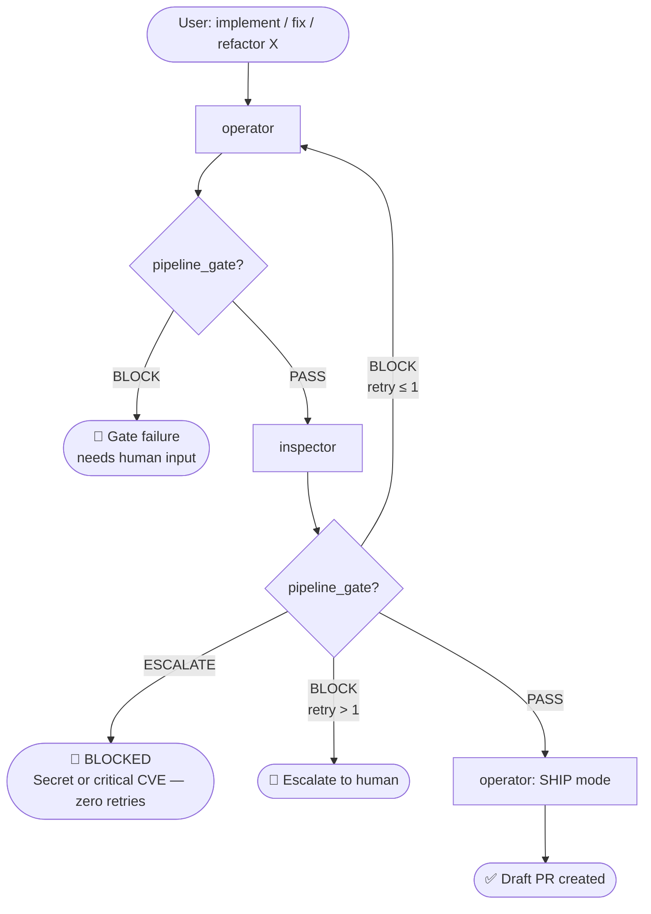
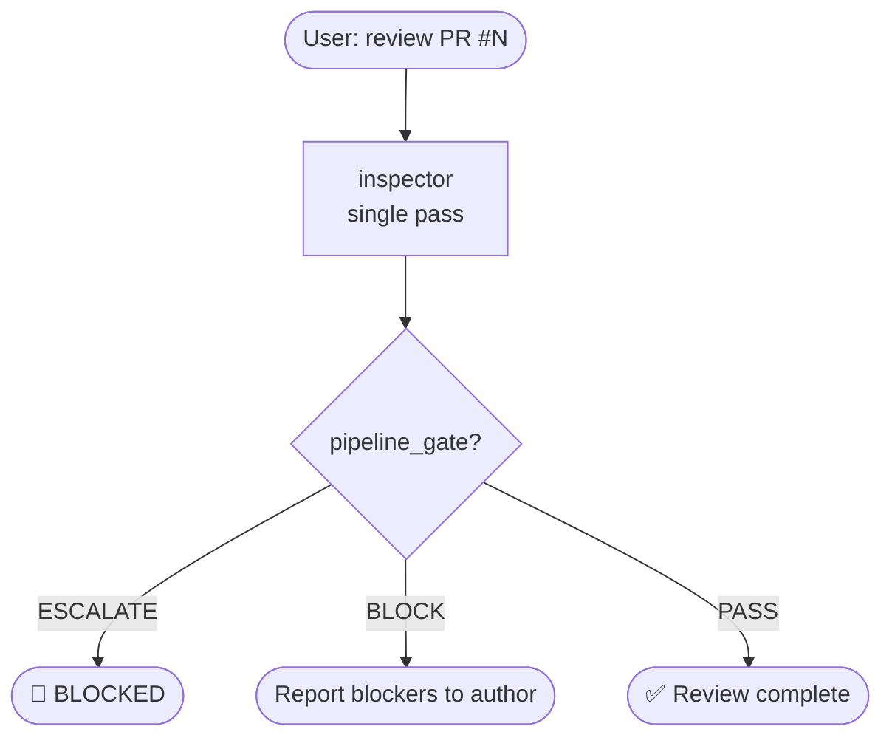
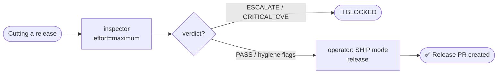

# Agent Harness

A "Lean 2" pair of Claude Code subagents covering the full engineering cycle — from understanding a requirement to opening a reviewed, tested, and secure pull request.

Each agent is a self-contained `.md` file with a YAML header and a system prompt. Drop either of them into `.claude/agents/` and Claude Code picks them up automatically.

---

## How it works

### 1. You describe the task

You type a goal in Claude Code — "implement per-tenant rate limiting" or "review PR #42 before I merge it".

### 2. The operator does the work

The **operator** plans (if the change is non-trivial), implements with TDD, writes tests, self-verifies, and — once review passes — commits, pushes, and opens the draft PR. One agent, run end-to-end inside a single task, instead of handing off between a planner/developer/tester/git-assistant chain.

### 3. The inspector checks it independently

The **inspector** runs read-only, adversarial, and never trusts the operator's self-report: secrets detection, OWASP/STRIDE, dependency/CVE audit, and a two-pass code-quality review all happen in one pass. It emits a trailing JSON block the calling workflow reads to decide whether to advance, retry, or escalate.

### 4. Quality gates enforce correctness

A `CRITICAL_BLOCK` from inspector loops back to the operator with specific `file:line` fix instructions (max 1 retry). A `SECRET_FOUND` or `CRITICAL_CVE` stops everything with zero retries.

### 5. The PR arrives clean

The operator creates a draft PR only after inspector has passed.

---

## Installation

```bash
# Copy both agents
mkdir -p your-project/.claude/agents
cp subagents/operator/operator.md your-project/.claude/agents/operator.md
cp subagents/inspector/inspector.md your-project/.claude/agents/inspector.md

# Shared linting/rule references both agents read
mkdir -p your-project/.claude/agents/rules
cp subagents/rules/*.md your-project/.claude/agents/rules/
```

Claude Code picks up any `.md` file in `.claude/agents/` automatically — no config needed.

---

## Where to start

**New to this?** Say `"implement X end to end"` or `"review PR #N"` — the [workflow scripts](../workflows/README.md) sequence `operator` and `inspector` for you with deterministic retry/escalation logic.

**Want full control?** Call either agent directly — both are fully self-contained. Tell `operator` which mode to run (`BUILD`, `REFACTOR`, `DOCS`, or `SHIP`); tell `inspector` an effort level (`low`/`medium`/`high`/`maximum`).

---

## Agents at a glance

| Agent | Role | Permission | Model |
|---|---|---|---|
| [operator](#operator) | Plans, implements (TDD), tests, self-verifies, refactors, diagnoses bugs, writes docs/CHANGELOG, ships (commit + draft PR) | `manual` | Sonnet |
| [inspector](#inspector) | Read-only adversarial review: secrets, OWASP/STRIDE, dependency/CVE audit, two-pass code quality | `semi-auto` | Sonnet |

---

## Pipelines

### New feature / bug fix / refactor



Refactor mode adds one extra short-circuit: `operator` returns `NO_TESTS` if no baseline exists, blocking before any code is touched.

---

### PR quality review



One `inspector` call replaces the old parallel code-reviewer + security-reviewer + dependency-auditor + synthesis step — inspector already covers all four dimensions per pass.

---

### Release prep



---

## Agent details

### operator

**Role:** Single heavyweight execution engine, run in one of four modes selected by the caller's prompt:

| Mode | What it does |
|---|---|
| `BUILD` | Load memory → plan (if 3+ files) → TDD implement → map test coverage → two-stage self-verify (Gate A spec, Gate B quality) → local commit. Folds in root-cause diagnosis for bug fixes with unknown cause. |
| `REFACTOR` | Confirm test baseline → refactor one smell at a time, testing after each → re-verify behavior unchanged. |
| `DOCS` | Update README/CLAUDE.md/docstrings/CHANGELOG → verify every code example runs. |
| `SHIP` | Pre-flight checks → push → draft PR with structured body → save findings to `.claude/memory/`. |

**Call it with:** `"implement X end to end"` · `"fix this bug"` · `"refactor the cache layer"` · `"ship the change"`

---

### inspector

**Role:** Isolated, adversarial reviewer. One pass, in priority order: SEC-4 secrets (zero-retry escalation) → OWASP A01–A10 + STRIDE (skipped/noted if not applicable) → dependency/CVE audit across every manifest → two-pass code-quality review (spec compliance, then correctness/security/quality/test-coverage/performance) at one of four effort modes (`low`/`medium`/`high`/`maximum`).

**Why merged from 4 agents into 1:** the old code-reviewer/security-reviewer/secret-scanner/dependency-auditor split meant 4 spawns reviewing the same diff. Inspector reads the diff once and runs all four passes in the same context.

**Call it with:** `"review PR #N"` · `"security review before merging"` · `"audit dependencies before release"` (pass `effort=high` or `effort=maximum` to override auto-detection)

---

## Communication protocol

Every agent ends its response with a single JSON block — the calling workflow reads `pipeline_gate` to decide: advance → retry → escalate.

```json
{
  "agent": "inspector",
  "status": "COMPLETE",
  "verdict": "CRITICAL_BLOCK",
  "pipeline_gate": "BLOCK",
  "blocking": true,
  "artifacts": [
    "Pass A (spec compliance): PASS",
    "Pass B (quality + security + deps): 2 findings",
    "Effort mode: medium"
  ],
  "findings": [
    { "severity": "Critical", "file": "handler.go", "line": 88, "message": "SQL injection" }
  ],
  "summary": "1 Critical finding blocks merge. SQL injection at handler.go:88."
}
```

Two invocation paths read this differently:

- **Workflow-driven** (`workflows/*.js`): `agent()` is called with a `schema` option, so the harness forces a structured tool call and returns the validated object directly — the calling script never parses text.
- **Direct/manual**: the caller parses the last ```json``` block in the response. Everything before it (the SEC-4 escalation report, narrative findings) is human-readable context, not part of the contract — only that trailing block is.

Calling workflows never pipe raw text between agents — they extract findings and re-structure the next prompt before dispatching.

---

## Verdict vocabulary

| Agent | Mode/context | Verdicts |
|---|---|---|
| `operator` | BUILD | `IMPLEMENTED` · `GATE_FAIL` |
| `operator` | REFACTOR | `REFACTORED` · `NO_TESTS` · `REGRESSION` |
| `operator` | DOCS | `DOCS_UPDATED` · `EXAMPLE_FAIL` |
| `operator` | SHIP | `PR_CREATED` · `PREFLIGHT_FAIL` |
| `inspector` | any | `CLEAN` · `MAJOR_ONLY` · `CRITICAL_BLOCK` · `SECRET_FOUND` · `HIGH_CVE` · `CRITICAL_CVE` |

Both agents always emit `pipeline_gate` (`PASS`/`BLOCK`/`ESCALATE`) — calling workflows branch on that field, not on the free-text verdict.

---

## How agents are built

Each agent is a single `.md` file. See [SCHEMA.md](SCHEMA.md) for the complete field reference.

```yaml
---
name: agent-name
description: |
  What this agent does and when to use it.

  <example>
  Context: user just finished implementing something.
  user: "Review my changes"
  assistant: "I'll use the inspector agent."
  <uses inspector agent>
  </example>
tools: Read, Bash, Grep, Glob
disallowedTools: [Write, Edit, MultiEdit, NotebookEdit]  # inspector only — it's read-only
model: claude-sonnet-4-6
color: yellow
permission_mode: semi-auto   # auto | semi-auto | manual
whenToUse:
  - "review code after implementation"
  - "pre-commit or pre-PR quality check"
---

You are a [role]. [System prompt follows...]
```

**`<example>` blocks** in `description` drive Claude Code's auto-routing — when the user's message matches the pattern, Claude suggests the agent.

**`disallowedTools`** blocks tool calls at the Claude Code runtime level. `inspector` also includes an `OPERATION CONSTRAINTS` prose block in its system prompt for a second enforcement layer at the model level.

**`permission_mode`** controls how tool calls are approved:
- `auto` — all calls proceed without prompting
- `semi-auto` — low-risk calls auto-approved, file mutations need approval (`inspector` — though it never mutates files anyway)
- `manual` — every tool call requires explicit approval (`operator` — it writes code and pushes to git)

---

## Roadmap

- `isolation: worktree` in agent frontmatter — run parallel mutating agents in isolated git worktrees without conflicts (runtime `isolation` in workflow `agent()` calls already works; frontmatter field is reserved)
- IDE LSP integration — `mcp__ide__getDiagnostics` always active for TypeScript projects
- Hook-driven automation (`PreToolUse`/`PostToolUse`/`Stop` hooks) to replace some of operator's and inspector's deterministic steps (test runs, dependency audits, secret scans) with scripts instead of LLM tool calls
